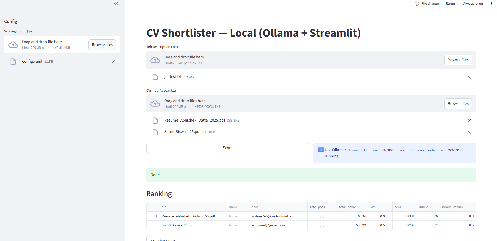
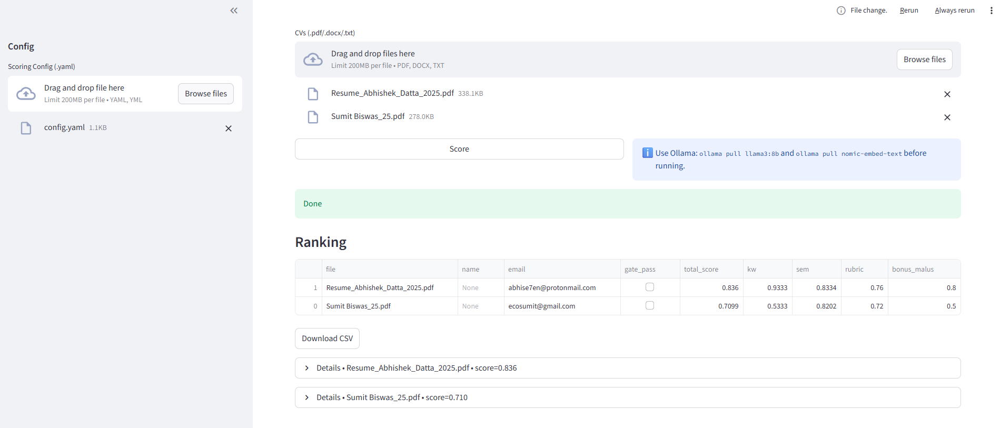
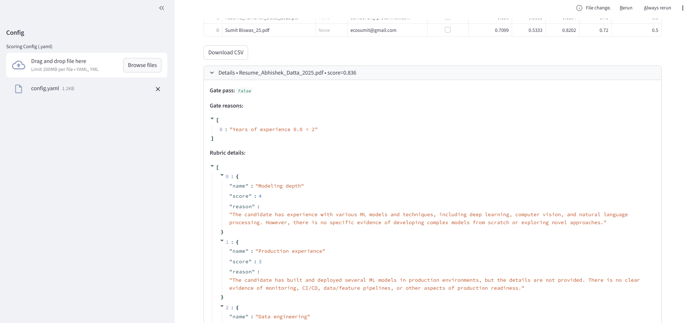
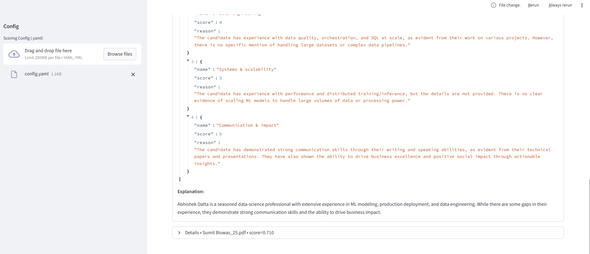

# CV Shortlister (Local, Ollama, Streamlit)

End‑to‑end, local CV sorting & scoring system that parses resumes (PDF/DOCX/TXT), extracts signals, and ranks candidates against a Job Description (JD). It complies with the capstone spec “CV Sorting using LLMs”: uses **Ollama w/ llama3:8b**, **LangChain** orchestration, **pyresparser**/**open‑resume** style extraction (with resilient fallback), semantic embeddings via **Ollama**, a transparent scoring rubric, and a **Streamlit** UI.


## Features
- Upload multiple CVs + one JD; get an **explainable ranking** with per‑criterion reasons.
- Hybrid scoring:
  - **Must‑haves gate** (years, required skills)
  - **Keyword coverage** (critical & desired)
  - **Semantic similarity** (JD↔CV chunks via Ollama embeddings)
  - **LLM rubric** with structured JSON output (llama3:8b via Ollama)
  - **Bonus/Malus** (leadership, publications, job hops proxy)
- Uses **LangChain** to template prompts and parse JSON reliably.
- Extraction via **pyresparser** when available; otherwise, robust fallback (regex + patterns).
- **Local‑first**: models run via Ollama; no external API calls.
- Export CSV/JSON; inspect per‑candidate explanations in UI.

> This project follows the provided guideline document exactly (models, steps, evaluation, repo hygiene).

## Architecture
```
cv-shortlister-ollama/
├─ app.py                # Streamlit UI
├─ config.yaml           # Scoring config & rubric
├─ src/
│  ├─ parsing.py         # Resume & JD parsing (pyresparser + fallback; PDF/DOCX/TXT)
│  ├─ jd_parser.py       # JD requirement extraction with LLM (LangChain + Ollama)
│  ├─ scoring.py         # Must-haves, keywords, semantic, rubric, bonus/malus
│  ├─ ranker.py          # End-to-end ranking pipeline
│  ├─ prompts.py         # Prompt templates
│  └─ ui_components.py   # Streamlit helpers
├─ data/
│  ├─ sample_jd.txt
│  └─ sample_cvs/        # Put sample PDFs/DOCX/TXT here
├─ evaluation/
│  └─ evaluate.py        # Offline eval: precision/recall/MAP given labels
├─ scripts/
│  ├─ setup_ollama.sh    # Pull models
│  └─ docker/Dockerfile  # Optional container
├─ requirements.txt
└─ README.md
```

## Prereqs
- Python 3.10+
- [Ollama](https://ollama.com/) installed & running locally
- (Windows) Visual C++ Build Tools may be required for some deps
- (Linux/Mac) standard build tools

## Install
```bash
git clone <your-repo-url>.git cv-shortlister-ollama
cd cv-shortlister-ollama

# Python deps
python -m venv .venv
source .venv/bin/activate  # Windows: .venv\Scripts\activate
pip install -r requirements.txt

# (Optional) spaCy model for pyresparser accuracy
python -m spacy download en_core_web_sm || true

# Ollama models
./scripts/setup_ollama.sh
```

## Run
```bash
streamlit run app.py
```
Open the local URL printed by Streamlit. Upload a JD (.txt) and a set of CVs (.pdf/.docx/.txt), then click **Score**.

## Config
See `config.yaml` to tune weights, must‑haves, and rubric.

## Evaluation (optional)
Put your ground‑truth labels in a CSV and run `evaluation/evaluate.py` to compute accuracy/precision/recall/MAP.

## App in Streamlit













## Read Output


| Column            | Meaning                                                                                                                                                        |
| ----------------- | -------------------------------------------------------------------------------------------------------------------------------------------------------------- |
| **gate\_pass**    | `True` if the CV satisfied all “must-have” requirements (minimum years, required skills, etc.) defined in **`config.yaml` → `must_haves`**. Otherwise `False`. |
| **gate\_reasons** | List of reasons why the candidate failed the gate. Examples: `["Years of experience 1.5 < 3", "Missing required skill: SQL"]`. Empty if `gate_pass` is `True`. |


| Column           | Meaning                                                                                                                                                                         |
| ---------------- | ------------------------------------------------------------------------------------------------------------------------------------------------------------------------------- |
| **scores**       | A JSON-like object storing all individual layer scores (keywords, semantic, rubric, bonus\_malus). Example: `{"keywords":0.82,"semantic":0.74,"rubric":0.8,"bonus_malus":0.1}`. |
| **kw**           | Convenience column: keyword-coverage score extracted from `scores.keywords` (0–1). Measures how many critical/desired skills appear in the CV.                                  |
| **sem**          | Semantic-similarity score (0–1). How close the overall text of the CV is to the JD using Ollama embeddings.                                                                     |
| **rubric**       | Average rubric score (0–1). The LLM reads the JD and CV and grades each rubric question on a 0–5 scale, normalized to 0–1.                                                      |
| **bonus\_malus** | Additional bonus/penalty value based on special signals (e.g., leadership keywords, publications, job hopping) defined in **`config.yaml` → `bonus_malus`**.                    |


While keyword counts and semantic similarity capture surface matches, rubric evaluations provide qualitative, evidence-based judgments.
The LLM reads both the JD and the full CV and then answers a set of rubric questions that you define in config.yaml.

# config.yaml

Below is the default structure with explanations and examples.
```bash

job_id: "JD-Template-001"   # Optional label for the job posting

weights:                   # Relative importance of each scoring layer
  keywords: 0.25           # Keyword match
  semantic: 0.35           # Embedding similarity
  rubric: 0.35             # LLM rubric evaluation
  bonus_malus: 0.05        # Optional bonuses/penalties

must_haves:                # Hard filters (candidate must pass to be “gate_pass: True”)
  min_years_total: 3
  required_skills: ["python", "sql"]
  nice_to_have: ["pytorch", "aws", "airflow"]
  location_any_of: ["Remote", "India", "EU"]

keywords:                  # Keyword weighting for scoring
  critical:
    python: 3
    sql: 2
  desired:
    pytorch: 2
    aws: 2
    airflow: 1

semantic:                  # Semantic similarity settings
  chunk_size: 1500         # Characters per chunk for embeddings
  overlap: 150             # Overlap between chunks
  topk: 8                  # Top-k chunks to average for semantic score

rubric:                    # LLM rubric questions
  - name: "Modeling depth"
    question: "How strong is the candidate in ML modeling beyond libraries?"
  - name: "Production experience"
    question: "Evidence of shipping ML to prod (monitoring, CI/CD, data/feature pipelines)?"
  - name: "Communication & impact"
    question: "Clear impact, collaboration, writing/speaking?"

bonus_malus:               # Optional bonuses or penalties
  recency_years: 3
  leadership_bonus: 0.5
  publication_bonus: 0.3
  job_hop_malus: -0.3

models:                    # Ollama models to use
  llm: "llama3:8b"
  embeddings: "nomic-embed-text"
```
# JD.txt
Example for JD

```bash

Position: Machine Learning Engineer

Responsibilities:
- Design and implement ML models for production.
- Build and maintain data pipelines and MLOps tooling.
- Collaborate with product and engineering teams.

Requirements:
- Minimum 3 years of experience in Machine Learning or Data Science.
- Strong programming skills in Python and SQL.
- Experience with cloud platforms such as AWS or GCP.
- Nice to have: PyTorch, Airflow, Docker, Kubernetes.


```

